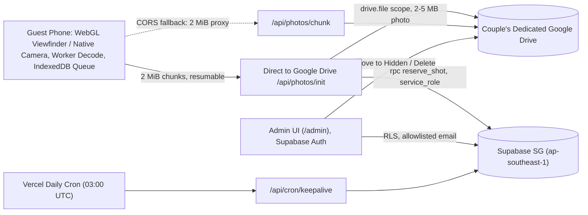

# Disposable Cam 📷

A mobile-first wedding web app where guests scan a table QR code, take up to $N$ candid photos with their phone (authentic 90s disposable film experience: WYSIWYG live WebGL viewfinder filter, develop-and-review step with Keep/Retake, and full-resolution resumable uploads), and photos land privately in the couple's Google Drive.

Built with **Next.js (App Router)** + **Supabase (Postgres & Auth in Singapore)** + **Google Drive API v3**, completely on **$0 free tiers**.

---

## Architecture



---

## 1. Supabase Setup (Singapore `ap-southeast-1`)

1. Create a free project at [supabase.com](https://supabase.com) in region **Singapore (`ap-southeast-1`)**.
2. Open **SQL Editor** in Supabase, copy and execute:
   - [`supabase/migrations/0001_init.sql`](supabase/migrations/0001_init.sql) (tables, RLS policies, `reserve_shot`, `release_shot`).
   - [`supabase/migrations/0002_rate_limits.sql`](supabase/migrations/0002_rate_limits.sql) (atomic `check_rate_limit` counter).
3. Add your admin email to `public.admin_emails` (must match `ADMIN_EMAILS` in `.env.local`):
   ```sql
   insert into public.admin_emails (email) values ('riefkyhd.dev@gmail.com');
   ```
4. Confirm or adjust the initial event row:
   ```sql
   insert into public.events (slug, couple_names, shots_per_guest, opens_at, closes_at)
   values ('our-wedding', 'Alice & Bob', 15, null, null)
   on conflict (slug) do nothing;
   ```
5. From **Project Settings → API**, copy:
   - `Project URL` → `NEXT_PUBLIC_SUPABASE_URL`
   - `anon public` key → `NEXT_PUBLIC_SUPABASE_ANON_KEY`
   - `service_role secret` key → `SUPABASE_SERVICE_ROLE_KEY` (keep strictly confidential).

---

## 2. Google Cloud & Drive Setup

Photos are stored directly in the couple's dedicated Google Drive using Google Drive API v3 (`drive.file` scope).

### 2.1 Google Cloud Project & OAuth Credentials
1. Log in to [Google Cloud Console](https://console.cloud.google.com/) using the **couple's dedicated Google account** (gives 15 GB of completely free storage).
2. Create a project: e.g. `disposable-cam-wedding`.
3. Enable **Google Drive API** in **APIs & Services → Library**.
4. Configure **OAuth Consent Screen**:
   - User Type: **External**.
   - App Name: `Disposable Cam`.
   - Developer email: couple's email.
   - Scopes: add `https://www.googleapis.com/auth/drive.file`.
   - **CRITICAL STEP:** Under Publishing status, click **"PUBLISH APP"** to set status to **"In production"**.
     > ⚠️ **IMPORTANT:** In "Testing" mode, Google revokes the OAuth refresh token after **7 days**, which causes uploads to fail on the wedding day. Setting it to "In production" ensures the token never expires.
5. In **Credentials → Create Credentials → OAuth client ID**:
   - Type: **Web application**.
   - Name: `Disposable Cam Web Client`.
   - Authorized redirect URIs:
     - Local development: `http://localhost:3000/api/auth/google/callback`
     - Production: `https://<your-vercel-domain>.vercel.app/api/auth/google/callback`
   - Copy `Client ID` and `Client Secret` into `GOOGLE_CLIENT_ID` and `GOOGLE_CLIENT_SECRET`.

### 2.2 One-Time Authorization & Dedicated Root Folder Creation
1. Start your local server (`npm run dev`) or deploy to Vercel.
2. Navigate to `/admin/connect-drive`.
3. Click **Authorize Google Account** and sign in with the owner's Google account (using the 400 GB plan).
4. The callback automatically:
   - Uses strict `drive.file` scope only so nothing else in your Google Drive is touched.
   - Obtains an offline `GOOGLE_REFRESH_TOKEN`.
   - Programmatically creates a dedicated root folder: `Disposable Cam - <couple_names>` in Google Drive.
   - Saves `drive_root_folder_id` in Supabase and displays both keys on screen.
5. Copy `GOOGLE_REFRESH_TOKEN` and `DRIVE_ROOT_FOLDER_ID` into `.env.local` and your Vercel Environment Variables.
6. **Share with Partner**: Open the created root folder in Google Drive (`https://drive.google.com/drive/folders/<DRIVE_ROOT_FOLDER_ID>`), click **Share**, and add your partner's email with **Editor** permissions. This allows both of you to view, download, and organize guest photos live from both phones.

---

## 3. Vercel Deployment Guide

1. Push this repository to GitHub or import it into [Vercel](https://vercel.com).
2. Set Function Region to **Singapore (`sin1`)** in Vercel project settings (matches Supabase `ap-southeast-1` for lowest latency).
3. Configure Environment Variables in Vercel:
   ```env
   NEXT_PUBLIC_SUPABASE_URL=https://<your-project>.supabase.co
   NEXT_PUBLIC_SUPABASE_ANON_KEY=<your-anon-key>
   SUPABASE_SERVICE_ROLE_KEY=<your-service-role-key>
   GOOGLE_CLIENT_ID=<your-google-client-id>
   GOOGLE_CLIENT_SECRET=<your-google-client-secret>
   GOOGLE_REFRESH_TOKEN=<your-google-refresh-token>
   DRIVE_ROOT_FOLDER_ID=<your-drive-root-folder-id>
   ADMIN_EMAILS=riefkyhd.dev@gmail.com
   CRON_SECRET=<random-secret-at-least-16-chars>
   TURNSTILE_ENABLED=false
   ```
4. Verify the daily keepalive cron:
   - Configured in `vercel.json`: runs `GET /api/cron/keepalive` daily at 03:00 UTC.
   - Prevents the Supabase free project from pausing due to inactivity before the wedding.

---

## 4. Admin Portal Guide (`/admin`)

Access the admin portal by visiting `/admin`.

### 4.1 Admin Authentication (`/admin/login`)
- Only email addresses allowlisted in `ADMIN_EMAILS` (and `public.admin_emails`) can log in.
- **First-Time Setup**: If you haven't set an admin password yet, click **"Initial Setup"**, type your email and desired password (minimum 8 characters), and click **"Create Password & Sign In"**.

### 4.2 Dashboard (`/admin`)
- Metric cards: **Confirmed Photos**, **Guests Registered**, **Drive Usage Bar** (against 15 GB free tier), and **Failed Uploads**.
- **Live Drive Health**: click "Run Live Health Check" to verify OAuth token validity, remaining storage quota, and test upload/deletion in the root folder.
- Quick links to open the root Google Drive folder and view recent photo logs.

### 4.3 Event Settings (`/admin/settings`)
- Couple names (displayed on camera header and table cards).
- **Shots Per Guest**: default 15 (adjustable between 1 and 100).
- **Manual Closed Switch**: instantly disable photo uploads if needed.
- **Scheduled Window**: optional `opens_at` and `closes_at` timestamps.
- **Theme Customizer**: adjust accent color (default `#D4AF37` gold) and dark background color (`#0C0A09`).

### 4.4 Photo & Guest Management (`/admin/photos`)
- **Guest Breakdown**: lists every guest with display name, registered date, last active timestamp, shot counter, and direct link to their per-guest subfolder in Google Drive.
- **Photo Records**: filter by `all`, `confirmed`, `hidden`, or `failed`.
- **Hide Photo**: moves the file in Google Drive to a `Hidden Photos` subfolder and marks status as `hidden` (note: hidden photos still count toward the guest's shot limit).
- **Delete Photo**: permanently deletes the file from Google Drive and removes the database record.

### 4.5 QR Code Generator & Print Table Cards (`/admin/qr`)
- Live QR preview pointing to `/e/<slug>`.
- **Download High-Res PNG** (1024x1024 px) for printing or graphic design.
- **Download Vector SVG** for banners and signage.
- **Print A6 Table Cards**: click "Print A6 Table Card" or press `Cmd+P`.
  - Formatted strictly for standard **A6 portrait (`105mm × 148mm`)**.
  - All admin navigation and headers are hidden; renders an elegant table card with gold ornaments, couple names, high-contrast QR code, and clear instructions ("Scan with your phone to take your 15 wedding photos!").

---

## 5. Guest Experience & Camera Capabilities

- **Guest Landing (`/e/[slug]`)**:
  - Warm editorial aesthetic with couple names, instructions, language toggle (**English default / Bahasa Indonesia toggle**), and privacy note ("Photos are visible only to the couple").
  - Anonymous guest creation and session stored in `localStorage` and `httpOnly` cookie.
- **Viewfinder & Disposable Feel**:
  - Full-screen `getUserMedia` (rear camera default with flip lens toggle).
  - Shutter animation with haptic feedback (`navigator.vibrate([35])`).
  - Retro LCD shot counter ("15 left").
  - **No photo preview**: guests never see captured photos; they go directly to the couple.
- **Camera Heuristics & Controls**:
  - **Lens Picker**: dynamically filters real back camera labels (iOS standard vs ultra-wide vs telephoto; Android vendor formats).
  - **Main Lens Preference**: avoids the iOS bug where `facingMode: "environment"` defaults to the ultra-wide lens.
  - **Zoom**: native slider on Android via `track.applyConstraints({ advanced: [{ zoom }] })`; digital 1x / 2x zoom on iOS Safari.
  - **Torch**: feature-detected toggle on Android; hidden on iOS.
  - **Stream auto-restart**: recovers stream on tab switch, lock/unlock, or incoming phone calls.
- **Client-Side Image Processing**:
  - Resized on phone to max 1920px longest edge, JPEG quality ladder (~0.8 to ~0.56) keeping files under ~900 KB (well within Vercel's 4.5 MB body limit).
  - Baked-in warm film tone, subtle vignette, and fine procedural film grain.
  - EXIF and GPS location data stripped.
- **Offline-Safe IndexedDB Queue**:
  - Stores captured shot immediately in IndexedDB with client-generated UUID `shotId`.
  - Background uploader with max 2 concurrent uploads, exponential backoff with jitter, and `Retry-After` header handling.
  - Automatically resumes queue on page reopen, airplane mode toggle, or connection recovery.
- **Native OS Camera Fallback**:
  - "Use my phone's camera app" button triggers `<input type="file" accept="image/*" capture="environment">`.
  - Session and pending state persisted before opening native camera so tab reloads preserve quota.
  - Same client resize, grain/tint, and idempotency pipeline.
- **Hardware Diagnostics (`/debug/camera`)**:
  - Accessible on real phones to inspect device labels, track constraints, and camera capabilities.

---

## 6. How the Atomic Shot Limit Works

Shot limit enforcement is handled server-side in Postgres via [`supabase/migrations/0001_init.sql`](supabase/migrations/0001_init.sql):
- `reserve_shot(event_id, guest_id, shot_id)` acquires an exclusive row lock (`select ... for update`) on the guest record.
- Serializes parallel requests from the same guest so concurrent bursts cannot exceed `shots_per_guest`.
- `shot_id` serves as an idempotency key: duplicate retries return the existing photo state without consuming extra shots.
- `failed` shots release the reserved slot; `hidden` shots continue to count toward the limit; stale `pending` reservations expire after 10 minutes.

---

## 7. Bulk Photo Download

After the wedding, the couple can download their entire wedding album in full resolution:

### Option A: Direct from Google Drive Web (One-Click)
1. Log in to [Google Drive](https://drive.google.com/) with the couple's dedicated Google account.
2. Locate the root folder: **`Disposable Cam - <couple_names>`**.
3. Right-click the folder and select **Download**.
4. Google Drive automatically packages all subfolders and photos into `.zip` archives.

### Option B: High-Speed Mirror via `rclone` (CLI)
For photographers or large collections:
```bash
# Configure rclone for Google Drive
rclone config

# Sync root wedding folder to local hard drive
rclone copy "google-drive:Disposable Cam - Alice & Bob" ./wedding-photos-backup/ -P
```

---

## 8. Automated Testing & Verification

Run the comprehensive test suite (unit tests, SQL logic on in-process Postgres, IndexedDB store, camera heuristics, and QR generation):

```bash
# Run all 56 automated vitest tests across 11 test suites
npm test

# Run TypeScript typecheck
npm run typecheck

# Run ESLint
npm run lint

# Run Next.js production build
npm run build

# Run high-concurrency load test (50 concurrent guests x 15 photos = 750 uploads)
npm run loadtest
```

### Concurrency Load Test Output
The load test (`scripts/loadtest.mjs`) simulates 50 concurrent guests shooting 15 photos simultaneously against the live Singapore Supabase database:
- **50 Concurrent Guests** x 15 shots = 750 operations in ~3.15s (238 ops/sec).
- **100% Shot Limit Enforcement**: 50 out of 50 16th-shot attempts rejected with `limit_reached`.
- **100% Idempotency**: duplicate submissions detected and preserved.
- **0 Dropped Photos**.
- **p95 Latency**: ~550 ms.

---

## 9. Pre-Wedding Checklist & Mobile QA

Follow this checklist 1–2 weeks before the wedding:

- [ ] **Google Cloud OAuth Status**: Confirm Consent Screen status is **"In production"** (NOT "Testing").
- [ ] **Dedicated Account**: Confirm authorization is done with the couple's fresh Google account (15 GB available).
- [ ] **Drive Health Status**: Open `/admin` and click **"Run Live Health Check"**; verify status is **GREEN**.
- [ ] **Keepalive Cron**: Confirm Vercel cron is enabled (`vercel.json`), or trigger `GET /api/cron/keepalive` with `CRON_SECRET` to verify.
- [ ] **Test on iPhone Safari**:
  - Scan QR code with iOS Camera.
  - Verify in-app camera opens with standard back lens (not ultra-wide).
  - Verify 1x / 2x digital zoom works.
  - Verify 15 shots can be taken and shutter haptics trigger.
- [ ] **Test on Android Chrome**:
  - Scan QR code with Google Lens / Chrome.
  - Verify pinch-to-zoom / zoom slider works.
  - Verify torch toggle functions.
- [ ] **Test In-App Browsers**:
  - Send `/e/<slug>` link via Instagram DM and WhatsApp.
  - Verify browser detection hint or native OS camera button fallback works smoothly.
- [ ] **Table Cards**:
  - Print test A6 card from `/admin/qr` on cardstock.
  - Verify QR code scans instantly in dim reception lighting.
- [ ] **Rehearsal**: Have 10–20 wedding party members take photos at the rehearsal dinner.
- [ ] **Post-Wedding Backup**: Download full Drive backup within 48 hours following the reception.
